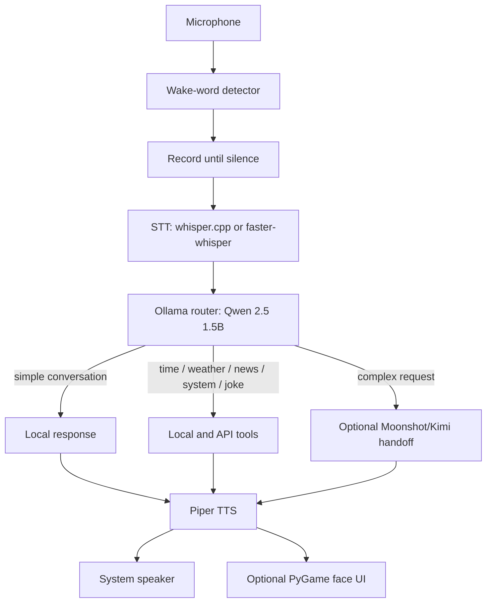

# Morris Agent

Morris Agent is a wake-word voice assistant built around a local Ollama model. It
records speech, transcribes it, routes requests to local tools or a cloud
model, and speaks the response through Piper TTS. The project began as an
assistant named **Morris**.

> Status: Cross-platform. The same checkout runs on Windows (ARM + x86/x64),
> macOS, and Linux (Debian/Ubuntu and Arch). After first setup, validate the
> full microphone → wake word → STT → TTS → UI workflow on the target machine
> before treating it as production-ready.

## What it does

```text
Microphone
  → wake-word detector
  → silence-bounded recording
  → speech-to-text
  → local Ollama router
      ├─ time, weather, news, system status, or joke tools
      ├─ local conversational reply
      └─ optional Moonshot/Kimi cloud handoff
  → Piper text-to-speech
  → speaker + optional animated PyGame display
```



## Features

| Capability | Implementation | Requires configuration? |
|---|---|---|
| Wake word | Custom openWakeWord ONNX model | Custom model is not tracked in this repository |
| Fallback wake word | Bundled openWakeWord `Hey Jarvis` model | No, when available in the installed package |
| Local chat and routing | Ollama with `qwen2.5:1.5b` | Ollama and model required |
| Speech-to-text | `whisper.cpp` when provisioned; otherwise faster-whisper | A local model or initial model download is required |
| Text-to-speech | Piper Python package + British English Semaine voice | Voice files required |
| Time and date | Python standard library | No |
| Weather | OpenWeatherMap | `OPENWEATHER_API_KEY` |
| News | NewsAPI | `NEWSAPI_KEY` |
| Joke | Official Joke API | Network connection |
| Complex questions | Moonshot/Kimi | `MOONSHOT_API_KEY` and network connection |
| System status | `psutil` | Installed by the desktop requirements file |
| Face UI | PyGame / SDL | Optional; target-display support varies by OS |

## Before you start

Morris Agent is not self-contained: the repository intentionally excludes large model
and voice assets. A runnable installation needs all of the following:

- Python 3.9 or newer
- Ollama and the `qwen2.5:1.5b` model
- A Piper voice model and its adjacent `.onnx.json` metadata file
- One STT backend and model:
  - `whisper.cpp` executable plus a local GGML model, or
  - faster-whisper with access to its model on first use
- A microphone and speaker selected by the operating system
- Optional: `models/wake_word/Morris.onnx` for the intended custom wake word

The first installation requires internet access to install packages and obtain
models. Runtime capabilities that call weather, news, jokes, or cloud AI also
require internet access.

## Linux setup (one-command)

The one-command installer targets Debian-based Linux:

```bash
git clone https://github.com/Mohammad-Faiz-Cloud-Engineer/Morris-Agent.git
cd Morris-Agent
chmod +x scripts/setup_raspi.sh
./scripts/setup_raspi.sh
```

It creates `venv313`, installs the Linux dependencies, installs Ollama,
builds whisper.cpp, and downloads the Piper voice. Then run:

```bash
source venv313/bin/activate
python orchestrator.py
```

If no custom Morris wake-word model is present, startup announces the fallback
phrase **“Hey Jarvis”**. Do not assume that the word **“Morris”** is active until
`models/wake_word/Morris.onnx` has been installed and startup confirms it.

## Desktop bootstrap

Run these commands from a native terminal, not WSL. The scripts create `.venv`,
install Python dependencies, and download the Piper voice. They do not yet
pre-download a faster-whisper model or verify all hardware paths.

| Platform | Bootstrap command |
|---|---|
| Windows PowerShell | `powershell -ExecutionPolicy Bypass -File .\scripts\setup_windows.ps1` |
| Windows, with Ollama via winget | `powershell -ExecutionPolicy Bypass -File .\scripts\setup_windows.ps1 -InstallOllama` |
| Debian / Ubuntu | `bash scripts/setup_debian.sh` |
| Arch Linux | `bash scripts/setup_arch.sh` |
| macOS with Homebrew | `bash scripts/setup_macos.sh` |

Install Ollama if the selected script does not do so, then fetch the local
model:

```bash
ollama pull qwen2.5:1.5b
```

Start Morris Agent with the Python interpreter in `.venv`:

```bash
# Linux or macOS
.venv/bin/python orchestrator.py

# Windows PowerShell
.\.venv\Scripts\python.exe orchestrator.py
```

## Configuration

Runtime configuration lives in [config/config.json](config/config.json). Paths
are relative to the repository by default; the code resolves them at startup.

```json
{
  "microphone_device": "",
  "speaker_device": "",
  "mic_sample_rate": 0,
  "target_sample_rate": 16000,
  "stt_backend": "auto",
  "stt_model_name": "base.en",
  "enable_ui": true,
  "use_framebuffer": false
}
```

### Audio devices

Leave `microphone_device` and `speaker_device` empty to use the operating
system defaults. To choose a specific device, set either field to a
sounddevice index or a unique, case-insensitive fragment of its name.

Set `mic_sample_rate` to `0` to use the input device’s reported native sample
rate. Morris Agent resamples captured audio to `target_sample_rate` for STT and wake
word inference.

### STT backend selection

`stt_backend` accepts:

- `auto` — use whisper.cpp only when both its executable and configured model
  exist; otherwise use faster-whisper.
- `whisper_cpp` — require the configured executable and GGML model.
- `faster_whisper` — require the Python package and configured model name.

For a repeatable, offline deployment, provision a local model before starting
the service and set the backend explicitly. Do not rely on an implicit first
run download in production.

### Display mode

`enable_ui` disables the face UI entirely when set to `false`.

`use_framebuffer` is intended only for a Linux framebuffer device, such as a
headless display. Leave it `false` on Windows, macOS, and normal
Linux desktop sessions so SDL can choose the native display driver.

## Optional API keys

Copy the template and add only the services you intend to use:

```bash
cp .env.example .env
```

```dotenv
OPENWEATHER_API_KEY=
NEWSAPI_KEY=
MOONSHOT_API_KEY=
```

Keys remain optional. Their corresponding tools respond with a configuration
message when no key is available.

## Project layout

```text
audio/       Microphone recording, WAV playback, Piper TTS, STT backends
brain/       Ollama client, router, cloud client, and tool implementations
config/      Runtime JSON and local/cloud personality prompts
senses/      openWakeWord listener
ui/          Optional PyGame face display
assets/      Face artwork and prerecorded filler speech
scripts/     Platform bootstrap and Piper voice downloader
tests/       Interactive component checks
```

## Verification and tests

The supplied tests are interactive component checks, not a complete automated
or cross-platform test suite:

```bash
# Linux installation (Debian-based)
source venv313/bin/activate

python tests/test_router.py
python tests/test_wake_word.py
python tests/test_audio_pipeline.py
```

Before a deployment, verify these real device paths on the target machine:

1. The configured/default microphone can record audio.
2. The configured/default speaker plays a generated Piper WAV file.
3. The selected wake phrase is the one announced at startup.
4. STT produces a transcript for a recorded sample.
5. Ollama is running and the configured model is installed.
6. The UI can be enabled on the actual display, or is deliberately disabled.

## Troubleshooting

| Symptom | Check |
|---|---|
| Voice model not found | Run the relevant setup script or place the Piper `.onnx` and `.onnx.json` files under `piper/voices/`. |
| No usable STT backend | Install/provision whisper.cpp and its model, or install faster-whisper and make its model available. |
| No microphone or speaker | Leave device fields blank for OS defaults, or set a valid sounddevice index/name in `config/config.json`. |
| Wake phrase does not work | Check the startup message. Without the custom model, the code uses the fallback `Hey Jarvis` model. |
| Ollama unavailable | Start Ollama and run `ollama pull qwen2.5:1.5b`. |
| UI fails | Set `"enable_ui": false` for a headless run, then investigate SDL/PyGame support on that target machine. |
| Weather, news, or cloud tool unavailable | Add the corresponding key to `.env`; network access is required. |

## Security and deployment notes

- Keep `.env` private. It is ignored by Git and must never be committed.
- Pin and verify Python dependencies and downloaded model checksums before a
  production rollout.
- Treat downloaded models as deployment artifacts: version, store, and verify
  them separately from source code.
- Run the assistant under a least-privilege account with access only to the
  microphone, speaker, display, and files it needs.

## License

MIT
